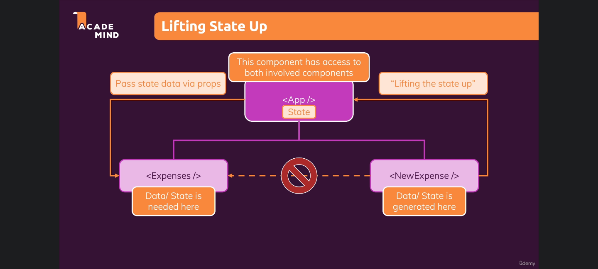
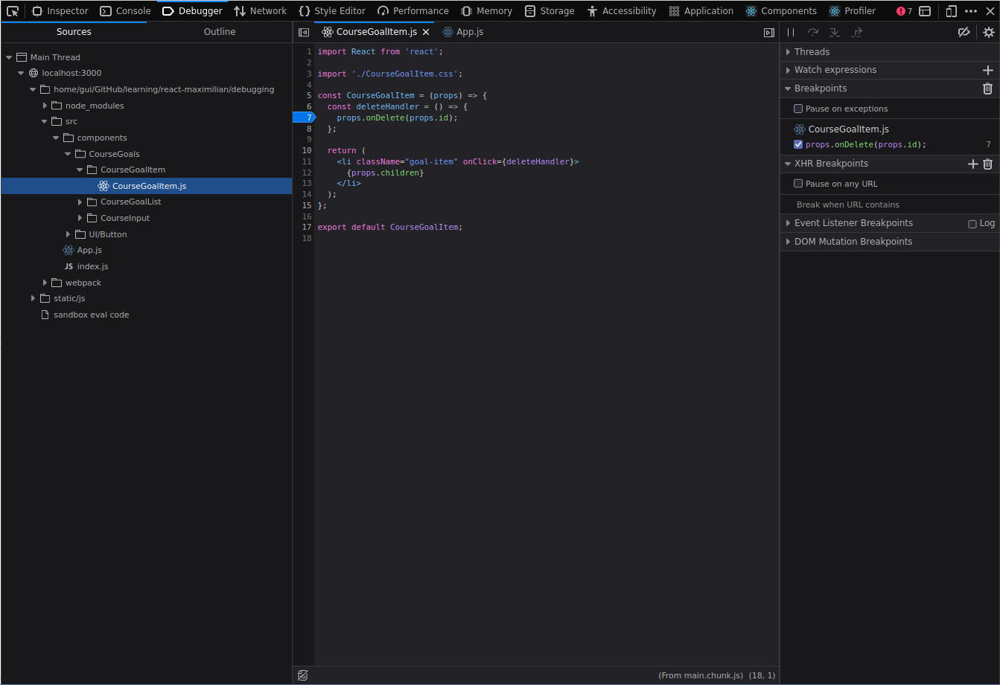

# React: The Complete Guide

This is the course "**React - The Complete Guide**" by Maximilian Schwarzmüller, and this is: **Things that I didn't know before enrolling this course**

**Important note:** this project uses **Yarn** instead of NPM.

# Section 2: JavaScript Refresher

## Destructuring

### Array Destructuring

```javascript
[a, b] = ["Hello", "Max"];

console.log(a); // Hello
console.log(b); // Max
```

### Object Destructuring

```javascript
{ name } = { name: "Max", age: 28 };

console.log(name); // Max
console.log(age); // undefined
```

# Section 3: React Basics & Working With Components

## Introducing JSX

- Thing that I already knew but have forgotten: "JSX" stands for "JavaScript XML"
- Thing that I didn't know: it's because HTML in the end **is** XML. Mind blowing!

### A Closer Look At JSX

- According to Maximilian, importing React fro 'react' is an archaic practice.
- Every React element, under the hood, is actually a `React.createElement()` function/method. It takes 3 arguments:
  - a string with the name of the object
  - an object containing attributes to configure the element
  - an infinite that represents elements inside the div tag

```javascript
return (
  <div>
    <h2>Let's get started</h2>
    <Expenses items={expenses} />
  </div>
);

return React.createElement(
  "div",
  {},
  React.createElement("h2", {}, "Let's get started"),
  React.createElement(Expenses, { items: expenses })
);
```

# Section 4: React State & Working with Events

- When using a `handleClick` inside an `onClick={}` prop, the reason why you should point to the function (e.g. `handleClick`) instead of calling it (e.g. `handleClick()`) is because its nature of being called only when there's a click, not in runtime. If you call the function, React will run it whenever the components is rendered.
- React is all about functions. Its rendering procedure is to call `<App />`, that calls its children, that call their children, and so on, until everything is rendered all at once. It's a stateless way of displaying HTML.
- By using state, React offers us a way to re-render something whenever some data changes. States makes React aware of changes dynamically. That's what it means to be **declarative** instead of just **imperative**.
- When you use the function provided by `setState()`s destructured array, it will trigger a re-render in the component where you set the data update.

## Updating State That Depends On The Previous State

- Sometimes, when you update a huge amount of data at the same time, like in a form for example, you can see yourself relying on a copy of your previous state that is already outdated. To solve this, you should use this syntax instead:

```javascript
// Old one:
setUserInput({
  ...userInput,
  enteredDate: value,
});
```

```javascript
// New one:
setUserInput((prevState) => {
  return {
    ...prevState,
    enteredDate: value,
  };
});
```

This method assures that you're using the last state snapshot instead of the last object created as a copy of the last updated state.

## Child-to-Parent Communication (Bottom-up)

If you declare a function in the parent, pass it as a prop to the child and make the child call it, it you can receive data generated in the child as a parameter, and then use it in the parent. I really didn't know that pattern.



The process is rather simple: it's passing data from a component to its sibling by finding their first common parent, which will receive the data and pass it down to its other child (the target one).

# 

# Section 5: Rendering Lists & Conditional Content

## Outputting Conditional Content

A different way to render conditional content: you can put all the rendering logic of mapped list into a let variable with a default value that can be updated it a certain condition is met. Then you render **the** variable that stores the HTML and its logic instead of calculating everything in the return of the function. Like this:

```javascript
  let expensesContent = (
    <div>
      <p1>No Expenses Found</p1>
    </div>
  );

  if (filteredExpenses.length > 0) {
    expensesContent = filteredExpenses.map((expense) => (
      <ExpenseItem
        key={expense.id}
        title={expense.title}
        amount={expense.amount}
        date={expense.date}
      />
    ));
  }

  return (
    <Card className="expenses">
      <ExpensesFilter
        selected={filteredYear}
        onChangeFilter={filterChangeHandler}
      />

      {expensesContent}
    </Card>
  );
```

# Section 6: Styling React Components

## Styled Components & Dynamic Props

É possível passar *props* para dentro dos components criados com o *styled* simplesmente passando elas como num componente normal.

```javascript
  & input {
    display: block;
    width: 100%;
    border: 1px solid ${(props) => (props.invalid ? "red" : "#ccc")};
    background: ${(props) => (props.invalid ? "salmon" : "transparent")}
    font: inherit;
    line-height: 1.5rem;
    padding: 0 0.25rem;
  }

  & input:focus {
    outline: none;
    background: #fad0ec;
    border-color: #8b005d;
  }
```

# Debugging React Apps

## Working with Breakpoints

Just breakpoints 101 here, even though even this knowledge is brand new to me. You can use open Debugging tab, navigate through Sources until you find the problematic file, and line, and then add a breakpoint to start pausing on every function call. Very helpful. 



# Fragments, Portals & Refs

## JSX Limitations

When dealing with the lack of an unique parent component for many children rendered side-by-side, you can use the `<Fragment />` as well as arrays:

```javascript
return [
    error && <ErrorModal />, // <-- the comma for each child 
    <Card>
        <p>Content</p>
    </Card>
]
```

But this method has a gotcha. It lacks the `key` prop. But you'll have to hardcode it.

## Portals

Semantically, modals should not be nested. Since it's an overlay, it should be above anything. It's like creating a button by setting a `<div />` with an `onclick={}` prop. It works, but it's wrong.

So we use Portals to transfer components to somewhere else in the real DOM using an `id` in the real DOM (`'/public/index.html'`) and `ReactDOM.createPortal()` in the component we want to move. The first `createPortal` parameter is the component to be transfered, and second is the reference to the `id` we set: 

```javascript
{ReactDOM.createPortal(
    <Backdrop onConfirm={props.onConfirm} />,
    document.getElementById("backdrop-root")
)}
```

## Refs

We can use **refs** instead of **states** to gather input values. But, since refs point to the actual DOM (instead of the Virtual DOM generated by React itself), manipulating them is not-recommended.

When you assign the `useRef()` to a const, you can use the `ref` prop to listen to it. It generates an object with a `current` property in it. Then you can, for example, use `exampleRef.current.value` to store values typed by the user. 

When you access values through refs, you are dealing with **Uncontrolled Components**. Their internal state is not controlled by React anymore, have this in mind. It's a side-effect of using less code to access the DOM directly through this hook.

# Side-Effects, Reducers, and Context API

The `useEffect()` hook has 2 parameters, a function, and an Array. The function is executed **after** every component evaluation if the specified dependency (in the array, the second parameter) changes. That means that `useEffect()` hook doesn't re-run whenever the component re-renders, it has its own lifecycle.

Note: when you update a state within `useEffect()`, it triggers an infinite loop because both `useEffect()` and `setState()` causes the component to run again. Explaining each step:

1. The component is rendered, so

2. The `useEffect()` runs because that's what it does

3. If there's a state update inside that `useEffect()`, then

4. The updating state will make the component to re-render

5. And here's the infinite loop: if the component re-renders, it triggers the step (2): `useEffect()` runs, causing the state to be updated again... and so on.

The `useEffect()`, as its name says, deals with side-effects. They often are HTTP requests, but they can also be, for example, keystrokes in a form your application is listening to.

## Using the useEffect() Cleanup Function

`useEffect` is capable of returning either an anonymous/arrow or a named function. 

This feature is useful when you need to run something **after** the main logic within the `useEffect()` runs. 

In the example, we set a timer to update the state that listens to the keystrokes only after the user stopped typing for 500ms. This is what happens: the function that sets the state will be updated only from time to time. But we still need to make it run the state update to record groups of characters typed, not only delaying them.

In this case we use the `return` of the `useEffect()` to clear the timeout after every `useEffect()` trigger. It the user starts typing before the time set in the `setTimeout()`, it will reset the time interval. By doing this, the state will register only bunches of characters at a time.

```javascript
useEffect(() => {
  const identifier = setTimeout(() => {
    setFormIsValid(
    enteredEmail.includes("@") && enteredPassword.trim().length > 6
    );
  }, 500);
  return () => {
    clearTimeout(identifier);
  };
}, [enteredEmail, enteredPassword]);
```

## useReducer()

Is a tool when you need **more powerful state management**. 

```javascript
// the good old useState() syntax:
const [state, updateStateFn] = useState(argument);

// the main useReducer() syntax:
const [state, dispatchFn] = useReducer(reducerFn, initialState, initFn);
```

It seems like the `useState()` function we already know, since inside the array that function returns there's a state snapshot and a function that updates it. But there's a key difference in this `dispatchFn` function: it dispatches an action that will be consumed by the first `useReducer()` argument, `reducerFn`. It holds both the last state snapshot and the action passed to it, and returns a new, updated state. 

Kinda tricky to understand; better seeing it in action (no pun intended!)

## useState() vs useReducer()

Max says we'll **know** when to use `useReducer()`. Sure, I'll trust my instincts and starting using in whichever place I see fit. He also says that we use it when `useState()` becomes too cumbersome. 

**He couldn't be more generic.**

### useState():

* The main state management built-in tool

* Typically we start using it

* Often is all you need

* Great for independent pieces of state/data

* Great if state updates are easy and limited to a few kinds of updates

| useState                                                              | useReducer                                                    |
| --------------------------------------------------------------------- | ------------------------------------------------------------- |
| The main state management built-in tool                               | Great if you need more power                                  |
| Typically we start using it                                           | Should be considered if you have related pieces of state/data |
| Often is all you need                                                 | Can be helpful if you have more complex state updates         |
| Great for independent pieces of state/data                            |                                                               |
| Great if state updates are easy and limited to a few kinds of updates |                                                               |

I **hate** vague/sloppy/generic explanations.

## React Context API

* Clearly there's a problem whenever you pass a prop to a component just for it to pass the prop downwards to another child component. 

* The other problem related to this practice is the prop drilling, which has to be avoided, even though its definition is kinda loose. You *feel* when you're practicing prop drilling.

* Built into React there's a behind-the-scenes, component-wide, **State Storage** named **React Context**. It allows us to trigger an action and pass it only to the component interested in it.

* When creating, for example, a file named `/store/auth-context.js`, we use kebab-case instead of CamelCase because it would imply that we're building a component inside it, which is not necessairly true.

### Context API limitations

* Good for state management between components' data, but not good to be used **in** components configuration

* Not optimized for high frequency changes. There's a better tool for this, namely **Redux**.
